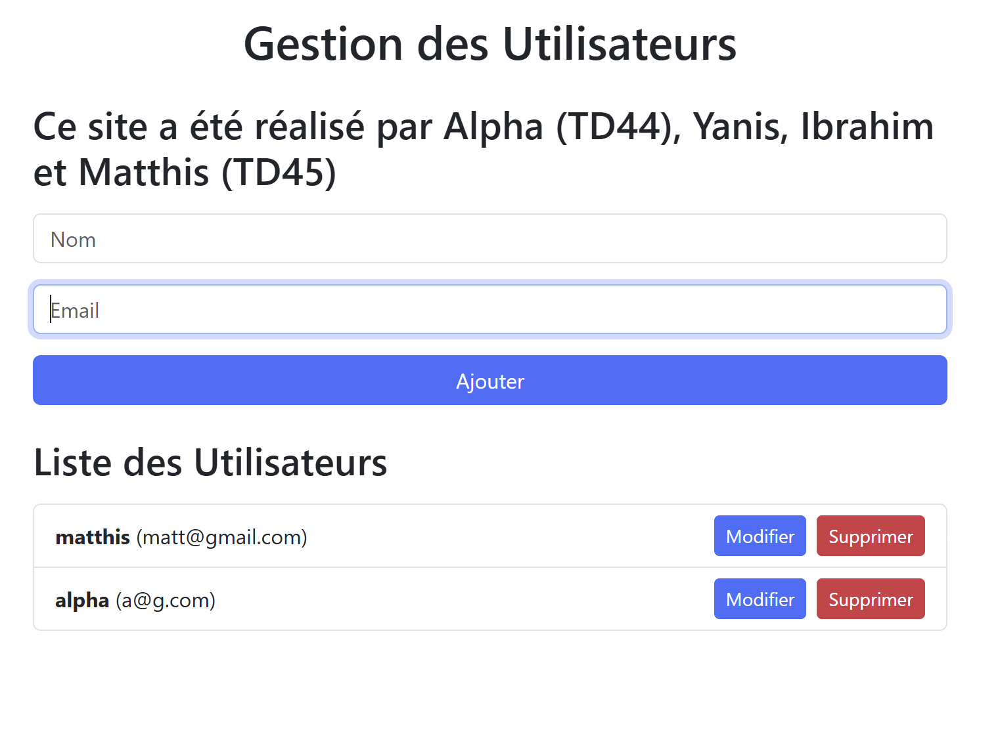
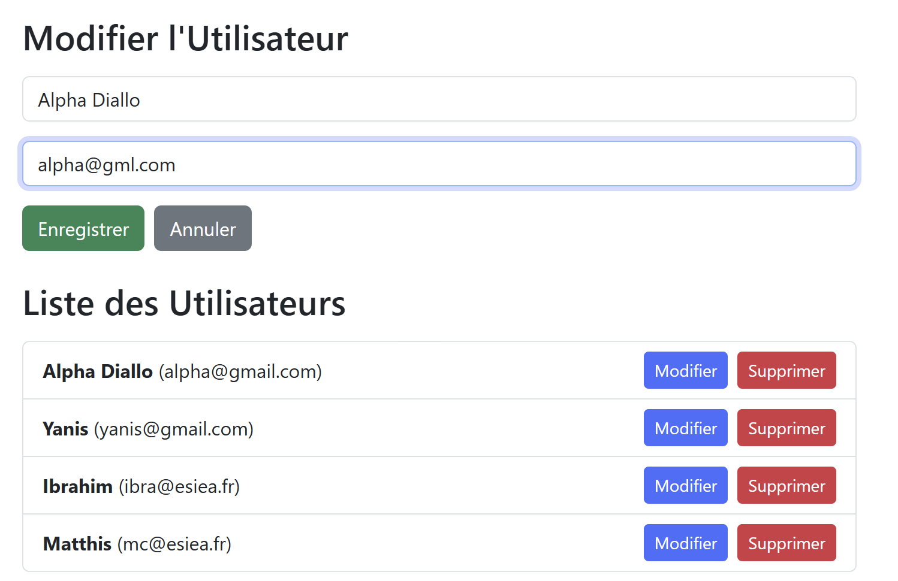

# Projet Final Virtualisation - Conteneur

Notre groupe est composé de Alpha Diallo en TD44, Yanis Oumellal, Matthis Corvis et Ibrahim Nimaga en TD45. Nous avons chois de faire une application simple de gestion d'utilisateurs en utilisant les technologies MERN (MongoDB, ExpressJS, React avec Bootstrap et NodeJS). Cette application permet d'ajouter, consulter, modifier et supprimer des utilisateurs. Les données sont stockées dans une base de données MongoDB.

## Développement du projet

L'API REST a été implémentée avec Node.js et Express.js. Elle fournit les endpoints suivants :

- POST /api : Ajoute un nouvel utilisateur.
- GET /api : Récupère tous les utilisateurs.
- PUT /api/:id : Modifie les informations d'un utilisateur existant.
- DELETE /api/:id : Supprime un utilisateur par son ID.

La base de données utilisée est MongoDB, hébergée localement via Docker. La connexion est configurée avec Mongoose dans le backend.

Le frontend a été développé avec React.js ainsi que Bootstrap pour le style. Il fournit les fonctionnalités suivantes :

- Formulaire d'ajout : Permet d'ajouter un utilisateur.
- Liste des utilisateurs : Affiche les utilisateurs avec des options de modification et suppression.
- Formulaire de modification : Permet de modifier les informations d'un utilisateur.

L'interface utilise Axios pour communiquer avec l'API backend. L'URL du backend est configurée dynamiquement via une variable d'environnement. 

## Conteneurisation avec Docker

Chaque personne a implémenté un Dockerfile, que ce soit pour le front ou le back. Pour la base de données, nous avons trouvé pas/peu pertinent de créer un Dockerfile car nous pouvons directement utilisé l'image officielle ce qui est une meilleure pratique dans le cadre de l'utilisation de MongoDB. Après avoir créé les services, nous avons pu faire notre `docker-compose.yml`. 

## Images 

